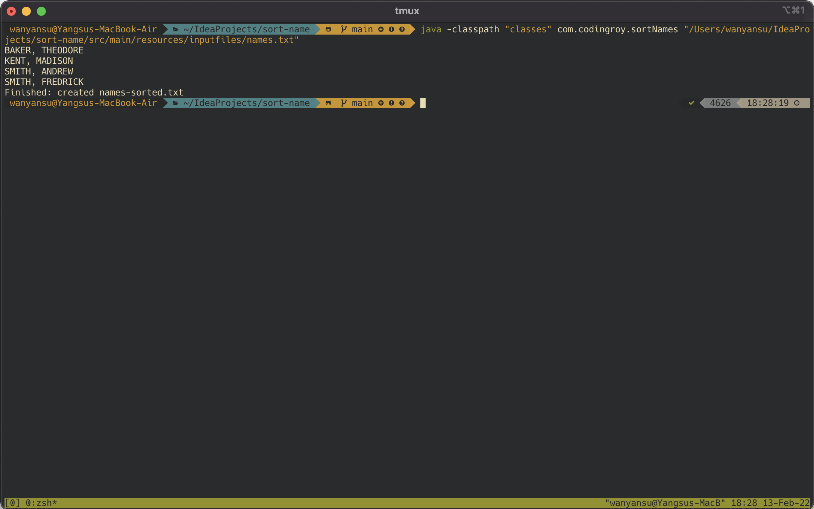

# Sorting Names

This is a Java project that builds a command line application to take a text file (txt) path as the only argument to sort the list of names in the text file and
output a sorted text file.

## Description

__The main test case is as follows:__

Enter the file path of a text file that containes the blow names:
```
BAKER, THEODORE
SMITH, ANDREW
KENT, MADISON
SMITH, FREDRICK
```

Sort the above list of names by last name first then by first name in an alphabetical order. Print the sorted names in the console and save to a new text file
adding a string `-sorted` after the original file name. The expected contents in the output text file are as follows:
```
BAKER, THEODORE
KENT, MADISON
SMITH, ANDREW
SMITH, FREDRICK
```
## Getting Started

### Installation

Use the following command to clone the repository to your local machine:
```
git clone 
```

### Execution

The execution outcomes are demonstrated in the below screenshot:



`-classpath "classes"` is to specify the folder in which all class files are saved so that the main program (sortNames.class) can be executed.

The file path argument in the end can be either a relatvie path, or a absolute path.

### Dependencies

* Maven - package manager
* JUnit - unit testing
* AssertJ - unit testing (asserting whether contents of two files are equal)

